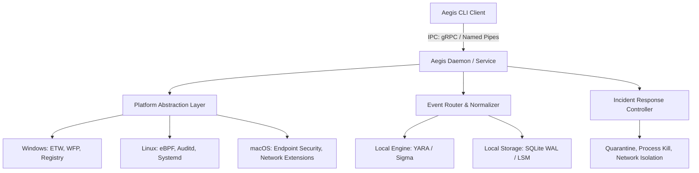

# 🛡️ AEGIS Endpoint Detection & Response (EDR)

[](https://github.com/aegis-edr/aegis/actions)
[](https://golang.org)
[](https://github.com/aegis-edr/aegis/security)
[](LICENSE)
[](https://github.com/aegis-edr/aegis)

AEGIS is an enterprise-grade, high-performance, cross-platform Endpoint Detection and Response (EDR) system. Built to operate as a low-overhead host security agent, AEGIS provides security teams with real-time visibility, automated threat detection, deep-dive forensics, memory inspection, and active response containment.

---

## 📖 Table of Contents

1. [Overview](#-overview)
2. [Vision & Philosophy](#-vision--philosophy)
3. [Features](#-features)
4. [System Architecture](#-system-architecture)
5. [Core Components](#-core-components)
6. [Technology Stack](#-technology-stack)
7. [Repository Structure](#-repository-structure)
8. [CLI Usage & Examples](#-cli-usage--examples)
9. [Configuration](#-configuration)
10. [Installation & Service Setup](#-installation--service-setup)
11. [Quick Start](#-quick-start)
12. [Roadmap](#-roadmap)
13. [Contributing](#-contributing)
14. [License](#-license)

---

## 🔍 Overview

AEGIS operates under a **CLI-first** administrative model, splitting operations between a privileged background service daemon (`aegisd`) and a user space control command-line interface (`aegis`). The agent is designed to run locally, autonomously detecting and mitigating threats with or without an active connection to a central dashboard.

---

## 🎯 Vision & Philosophy

### 👁️ The Vision
To establish an open, highly auditable, and extensible endpoint protection baseline that matches or exceeds proprietary enterprise EDR capabilities without introducing opaque agent behaviors or telemetry locking.

### 🧠 Core Philosophy
- **CLI-First**: All daemon features, detection states, and configuration controls are scriptable and exposeable via standard CLI outputs.
- **Transparency**: Zero telemetry cloaking. Rules, logs, databases, and configuration settings are stored in standard formats (SQLite, JSON, YAML) directly on the host.
- **Defense in Depth**: Multiple engines (Signature, Heuristic, Behavioral) run in parallel so that a single signature bypass does not compromise host security.
- **Local Autonomy**: Real-time correlation, rule evaluation, and active containment occur locally on the agent, minimizing latency and surviving network cuts.

---

## ✨ Features

AEGIS contains an enterprise-level feature set designed for modern threat hunting, incident response, and forensic inspection.

### 1. OS-Native Telemetry Monitoring
- **Process Auditing**: Capture process creation events, parent-child lineages, environment variables, command arguments, and exit statuses.
- **File Integrity**: Monitor file creation, writes, renames, deletions, and executable transition events.
- **Windows Registry Auditing**: Real-time tracking of persistent registry changes (`Run`, `RunOnce`, services, and driver configurations).
- **USB & Peripheral Auditing**: Capture physical USB media inserts, parsing Vendor IDs (VID), Product IDs (PID), and block mounting policies.
- **Driver & Kernel Extensions**: Capture driver mounting (`sys_init_module` on Linux, KEXT loads on macOS, driver signature validations on Windows).
- **Network Flow Logs**: Real-time auditing of socket connections, listening ports, remote IPs, and hostnames.

### 2. Multi-Engine Detection Pipeline
- **Hash Reputation**: In-memory matching of executed binaries against local SHA256 reputation blacklists.
- **YARA Evaluator**: Raw file and memory scanning utilizing compiled YARA rule bytes natively.
- **Behavioral Correlation (Sigma)**: Continuous evaluation of ECS-normalized event logs against Sigma rules.
- **Heuristic Anomalies**: Detection of anomalous process trees (e.g., MS Office spawning CMD), suspicious shell arguments, and hotpatch modifications.

### 3. Deep Memory Analysis
- **DLL Injection Check**: Identification of unbacked executable memory mappings (`PAGE_EXECUTE_READWRITE` regions without corresponding files on disk).
- **Reflective Loader Detection**: Scanning process heap segments for unaligned PE headers (`MZ`) or ELF magic bytes (`\x7fELF`).
- **Hook Auditing**: Cross-analyzing live memory library code segments against their disk formats to detect inline redirection.

### 4. Active Incident Response & Mitigation
- **Process Terminations**: Kill malicious process trees recursively (`SIGKILL` / `TerminateProcess`).
- **Cryptographic File Quarantine**: Lock, encrypt (AES-256-GCM), strip permissions (ACL), and relocate target files to a secure directory.
- **Network Isolation**: Block inbound and outbound network sockets using OS firewalls (WFP, iptables/nftables, pfctl).
- **USB Container Block**: Instantly disable USB storage device nodes.

### 5. Digital Forensics
- **Forensic Timelines**: Compile process, file, and network logs chronologically to generate unified timeline reports (JSON, CSV, Markdown).
- **System Artifact Extractors**: Extract OS-specific forensic artifacts (Prefetch, Shimcache, Amcache, launchd/systemd logs, shell histories).

---

## 📐 System Architecture

AEGIS implements a strictly decoupled client-server structure running locally on the endpoint:



### Telemetry Normalization Pipeline
1. **OS Telemetry Hook**: Probes (ETW, eBPF, ESF) intercept system calls.
2. **Event Router**: Telemetry events are parsed and normalized into the standardized Aegis Event Format (AEF) using the Elastic Common Schema (ECS).
3. **Queue**: Events are pushed onto an in-memory concurrent ring buffer.
4. **Evaluation**: Worker pools evaluate queue events against local YARA and Sigma rules.
5. **Storage**: Normalized event records are committed to the local SQLite database.

---

## 📦 Core Components

- **`aegis`**: The command-line utility. Used by administrators to run folders scans, verify service status, trigger containment actions, and build forensic timelines.
- **`aegisd`**: The background service daemon. Runs as a highly privileged service (`root` / `SYSTEM`). Spawns telemetry hooks, runs database migrations, compiles rules, and evaluates risk scores.
- **Platform Abstraction Layer (PAL)**: Dynamic Go assembly wrappers abstracting Windows ETW, Linux eBPF/Fanotify, and macOS Endpoint Security APIs.
- **Rule Evaluator**: A state-tracking runtime that matches concurrent system events against compiled Sigma conditions.
- **Local Storage Manager**: Manages database WAL writes, B-Tree indices on metadata fields, and daily log rotation/pruning pipelines.

---

## 🛠️ Technology Stack

| Component | Technology | Description |
|---|---|---|
| **Core Language** | Go (Version 1.22+) | High-speed concurrency, platform compilation, memory safety |
| **System Code** | C / Assembly | Zero-overhead memory scans and entropy math routines |
| **CLI Engine** | Cobra | POSIX-compliant subcommand parsing and flag handling |
| **Local Database** | SQLite 3 | WAL enabled; persistent telemetry cache & configurations |
| **LSM Buffer** | BadgerDB | High-throughput raw event log staging |
| **IPC Protocol** | gRPC | High-speed local RPC over Unix Sockets and Named Pipes |
| **Rule Engines** | libyara (v4.5+) & Sigma | Standardized signature scanning and log correlation |
| **Agent Logs** | Zap | High-performance, zero-allocation structured JSON logs |

---

## 📂 Repository Structure

The monorepo architecture isolates OS wrappers, engine logic, and interfaces:

```text
aegis-edr/
├── cmd/
│   ├── aegis/             # User-facing administration CLI
│   └── aegisd/            # Root/SYSTEM background EDR service daemon
├── pkg/
│   ├── api/               # gRPC Service Definition, Protobuf contracts
│   ├── config/            # Policy structures, YAML parser, profile configs
│   ├── detect/            # Core Detection Engines
│   │   ├── signature/     # YARA wrapper, Hash reputation matching
│   │   ├── behavioral/    # Sigma engine interface, event state tracker
│   │   └── heuristics/    # Entropy calculator, process parent-child mapping
│   ├── forensics/         # Timeline builders, Prefetch/Shimcache/Auditd parsers
│   ├── monitor/           # Cross-platform Event Telemetry Gatherer
│   │   ├── platform/      # OS specific hooks (ETW/ESF/eBPF implementation)
│   │   └── eventrouter/   # Normalizer converting platform events to ECS
│   ├── response/          # Remediation modules (firewall block, quarantine, process kill)
│   ├── storage/           # Database layer (SQLite engine, Write-Ahead Logs)
│   └── sdk/               # Plugin SDK and WASM hooks
```

---

## 💻 CLI Usage & Examples

The `aegis` client is the administrative console.

### Check Agent Status
Verify the running daemon state, current CPU/RAM footprints, loaded rule counts, and local database storage consumption:
```bash
aegis status
```

### Directory Static Scan
Scan files within a specific folder recursively using the loaded YARA rule database and output the results as a JSON array:
```bash
aegis scan /path/to/scan --recursive --format json
```

### Live Events Monitoring Dashboard
Launch the interactive terminal dashboard (TUI) showing real-time process execution, open socket states, and matching rules:
```bash
aegis monitor --interactive
```

### Manage Rules
Validate new Sigma/YARA rules and add them to the local daemon engine:
```bash
aegis rule validate ./my_rules/susp_rule.yml
aegis rule add ./my_rules/susp_rule.yml
```

### Host Containment Actions
Manually trigger active response playbooks on target endpoints:
```bash
# Terminate a process tree by PID
aegis response kill --pid 5432

# Isolate the endpoint from the network (except IPC and control API ports)
aegis response isolate --ip 192.168.1.100

# Quarantine a file (encrypt and strip permissions)
aegis response quarantine --file /tmp/malware.elf
```

### Forensic Timeline Generation
Gather host events and compile them into a chronological markdown timeline for the past 6 hours:
```bash
aegis forensics timeline --duration 6h --format markdown
```

---

## ⚙️ Configuration

AEGIS reads policies, profiles, and engine parameters from a central configuration file located at `/etc/aegis/aegis.yaml` (Linux/macOS) or `C:\ProgramData\Aegis\config\aegis.yaml` (Windows).

```yaml
agent:
  id: "agent-node-01"
  log_level: "info"
  ipc_socket: "/var/run/aegis.sock"
  heartbeat_interval_seconds: 30

telemetry:
  process_monitoring: true
  file_monitoring: true
  registry_monitoring: true # Windows only
  network_monitoring: true
  usb_monitoring: true

engines:
  hash_reputation:
    enabled: true
    db_path: "/var/lib/aegis/reputation.db"
  yara:
    enabled: true
    rules_dir: "/etc/aegis/rules/yara"
  sigma:
    enabled: true
    rules_dir: "/etc/aegis/rules/sigma"
  heuristics:
    entropy_threshold: 7.2

storage:
  path: "/var/lib/aegis/telemetry.db"
  retention_days: 7
  max_size_mb: 500

response:
  auto_mitigation: false
  risk_threshold: 8.5
  actions:
    - name: "isolate_network"
      enabled: true
    - name: "kill_process"
      enabled: true
```

---

## 📥 Installation & Service Setup

Ensure you compile the binaries matching your system architecture:

### 🐧 Linux (systemd)
```bash
# 1. Compile daemon and client
make build-linux

# 2. Run installer script (installs binaries to /usr/bin/ and copies configs)
sudo make install

# 3. Enable and start aegisd service daemon
sudo systemctl daemon-reload
sudo systemctl enable aegisd
sudo systemctl start aegisd

# 4. Verify CLI client connection
aegis status
```

### 🍎 macOS (launchd)
```bash
# 1. Compile macOS targets
make build-darwin

# 2. Install binaries and load launchd plist configuration
sudo make install-darwin
sudo launchctl load /Library/LaunchDaemons/com.aegis.aegisd.plist

# 3. Verify CLI client connection
aegis status
```

### 🪟 Windows (Service Manager)
Run from an Administrator Command Prompt or PowerShell terminal:
```powershell
# 1. Compile Windows targets
make build-windows

# 2. Register aegisd as a Windows Service
New-Service -Name "AegisEDR" -BinaryPathName "C:\Program Files\Aegis\aegisd.exe --config C:\ProgramData\Aegis\aegis.yaml" -DisplayName "AEGIS EDR Service" -StartupType Automatic

# 3. Start the service
Start-Service -Name "AegisEDR"

# 4. Check client status
.\aegis.exe status
```

---

## 🚀 Quick Start

Follow these steps to get AEGIS monitoring system events:

1. **Verify Connection**:
   Ensure the client successfully connects to the daemon:
   ```bash
   aegis status
   ```
2. **Add a Sigma Rule**:
   Copy a Sigma rule to the rule directory:
   ```bash
   sudo cp ./examples/rules/susp_powershell_download.yml /etc/aegis/rules/sigma/
   ```
3. **Reload Rules**:
   Tell the daemon to compile and load the new rule:
   ```bash
   aegis rule list
   ```
4. **Trigger Live Monitor**:
   Open the interactive event monitor to observe telemetry stream in real-time:
   ```bash
   aegis monitor --interactive
   ```

---

## 🗺️ Roadmap

### Phase 1: Core Telemetry & CLI (Current Phase)
- [x] Privileged daemon (`aegisd`) and CLI client (`aegis`) split.
- [x] Windows ETW, Linux eBPF, and macOS Endpoint Security telemetry collectors.
- [x] SQLite local storage integration with WAL configuration.
- [x] Command-line structure framework.

### Phase 2: Multi-Engine Detection & Verification
- [ ] Local YARA compiler and dynamic memory scanning wrappers.
- [ ] Sigma rule streaming evaluator engine.
- [ ] Shannon Entropy analysis for packers/encryption detection.
- [ ] Unit, integration, and fuzz testing pipeline.

### Phase 3: Incident Response Containment
- [ ] Firewall isolation module implementation (WFP, iptables, pfctl).
- [ ] Process tree containment termination controller.
- [ ] AES-256-GCM file quarantine protocol handler.
- [ ] Forensics timeline builder.

### Phase 4: Swarm Operations & Dashboards
- [ ] Fleet Dashboard Next.js management console.
- [ ] WASM-based sandboxed Plugin SDK.
- [ ] Peer-to-peer threat intelligence swarm sharing alerts.

---

## 🤝 Contributing

We welcome contributions from the open-source cybersecurity community. To get started:

1. **Fork** the repository and clone your fork.
2. Create a branch: `git checkout -b feature/your-awesome-feature`.
3. Adhere to [Conventional Commits](https://www.conventionalcommits.org/) standards.
4. Open a **Pull Request** detailing your changes.

Ensure your code is properly formatted and passes all local lint checks before submitting a PR:
```bash
golangci-lint run ./...
```

---

## 📄 License

AEGIS is licensed under the Apache License, Version 2.0. See [LICENSE](LICENSE) for details.
