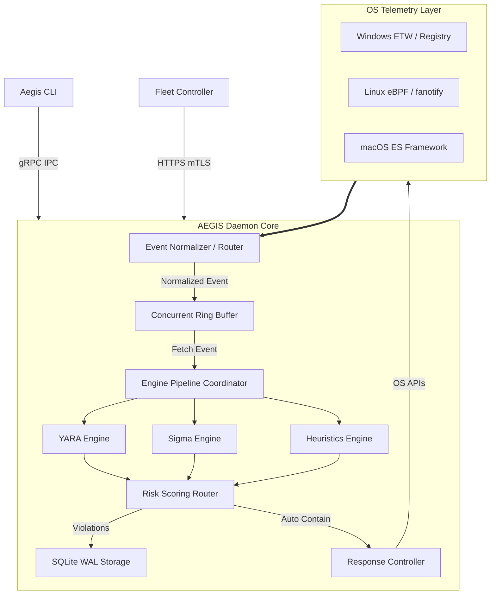
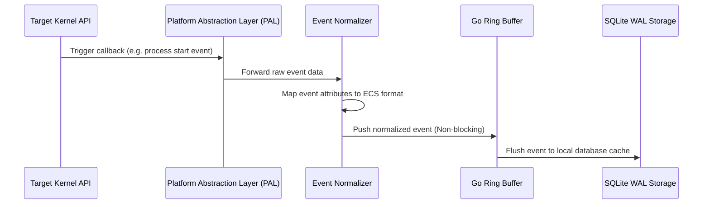
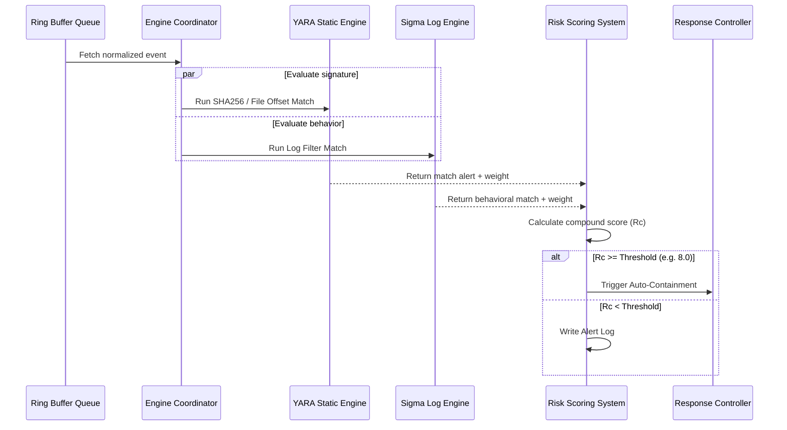
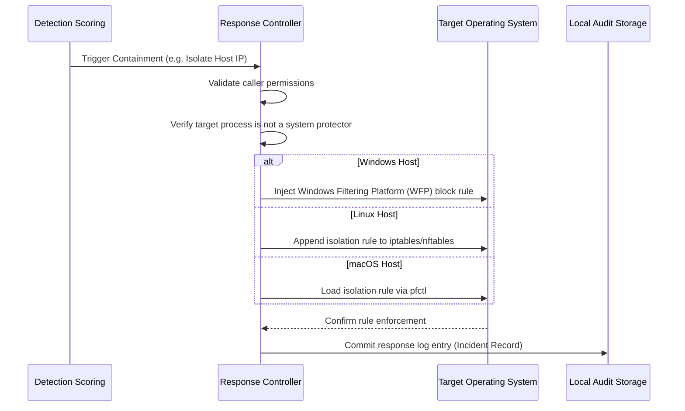

# 📐 AEGIS EDR - System Architecture Design Document

This document details the high-level design, component boundaries, data ingestion flows, rule evaluation pipelines, and response workflows of the AEGIS Endpoint Detection and Response (EDR) platform.

---

## 1. High-Level Architecture

AEGIS implements a strictly partitioned local architecture separating the administration interfaces from the high-privilege event monitoring loop. This boundary ensures system security and stability while enabling easy automation script integration.

```
                      +---------------------------------------+
                      |               AEGIS CLI               |
                      |          (User space tool)            |
                      +-------------------+-------------------+
                                          |
                                          | gRPC over local IPC
                                          v
+---------------------------------------------------------------------------------------+
|                                     AEGIS DAEMON                                      |
|                                (SYSTEM / root service)                                |
|                                                                                       |
|  +--------------------+      +--------------------+      +-------------------------+  |
|  | Telemetry Monitors | ===> |  Event Normalizer  | ===> |  Go In-Memory Queue     |  |
|  |  (ETW, eBPF, ESF)  |      |   (ECS mapping)    |      | (Concurrent Ring Buffer)|  |
|  +--------------------+      +--------------------+      +------------+------------+  |
|                                                                       |               |
|                                                                       v               |
|  +--------------------+      +--------------------+      +------------+------------+  |
|  |  Incident Response | <=== |   Decision Engine  | <=== |    Detection Engine     |  |
|  | (Quarantine, Kill) |      | (Scoring / Router) |      | (YARA, Sigma rules)     |  |
|  +--------------------+      +--------------------+      +-------------------------+  |
|                                                                                       |
+---------------------------------------------------------------------------------------+
```

### 1.1 The Daemon-CLI Partition
- **Aegis CLI (`aegis`)**: Runs in user space. It parses command-line flags and streams requests to the local daemon socket. It formats database queries and scan outputs as stdout streams.
- **Aegis Daemon (`aegisd`)**: Runs as a background service/daemon under high system privilege (`SYSTEM` on Windows, `root` on Unix). It maintains persistent handles to OS telemetry logs and runs threat containment code.
- **IPC boundary**: Initiated via **gRPC over Unix Domain Sockets** on macOS/Linux and **gRPC over Named Pipes** on Windows. Communication payloads are encrypted using mutual TLS (mTLS) with dynamically rotated keys.

---

## 2. Component Architecture



---

## 3. Internal Architecture & Concurrency Model

AEGIS uses Go's native concurrent patterns to guarantee low latency under heavy event storms.

```
                    +------------------------------------+
                    |        Normalized Event            |
                    +-----------------+------------------+
                                      |
                                      v
                    +------------------------------------+
                    |  Concurrent In-Memory Ring Buffer  |
                    |           (Channel size)           |
                    +------+----------+----------+-------+
                           |          |          |
                           | Worker 1 | Worker 2 | Worker 3
                           v          v          v
                    +------------------------------------+
                    |        Rule Evaluation Pools       |
                    | (Non-blocking parallel execution)  |
                    +------------------------------------+
```

### 3.1 Concurrency Design
1. **The Ingest Buffer**: Events from telemetry monitors are normalized and pushed to an in-memory concurrent ring buffer.
2. **Worker Pools**: A configurable pool of worker goroutines reads from the buffer. Each worker processes events non-blockingly, running rules and heuristic scans in parallel.
3. **Lockless Telemetry Indexing**: Event persistence is delegated to a dedicated worker loop. Database writes are committed sequentially to the WAL-mode SQLite database, preventing file-level write lock bottlenecks.

---

## 4. Module Responsibilities

### 4.1 Telemetry Gathering
- **Target**: Interface directly with OS kernel events.
- **Mechanism**: Registers callbacks on native audit subsystems. Captures process creation, file I/O operations, network state updates, driver loads, and peripheral mounts.

### 4.2 Event Router
- **Target**: Transform system-specific data structures into a unified event format.
- **Mechanism**: Maps platform event parameters (e.g., Windows Security ID vs. Linux UID) to a unified event schema based on the Elastic Common Schema (ECS).

### 4.3 Detection Engines
- **Target**: Identify known malware signatures and malicious behaviors.
- **Mechanism**: Evaluates rules against live telemetry streams and memory offsets. Runs static hashes against reputation files, parses memory heaps, and matches Sigma-based log patterns.

### 4.4 Incident Response
- **Target**: Mitigate active threats and contain infected endpoints.
- **Mechanism**: Executes host containment workflows (process termination, network isolation, cryptographic quarantine) using native OS APIs to minimize dependency footprints.

### 4.5 Persistent Storage
- **Target**: Fast, resilient logging.
- **Mechanism**: Manages local data indexes and retention policies, maintaining a 7-day rolling window of system telemetry.

---

## 5. System Execution Flows

### 5.1 Event Monitoring Pipeline
This pipeline processes OS events from initial capture through normalization and queuing to final storage:



---

### 5.2 Threat Detection Pipeline
This pipeline evaluates normalized events against detection engines, calculates risk scores, and routes alerts:



---

### 5.3 Active Containment Response Workflow
This workflow handles incident response actions from policy triggers to execution and verification:



---

## 6. Scalability & Performance Under Load

AEGIS is designed to remain stable and performant under heavy system load:
- **Event Dropping Policy**: If the ring buffer fills up under extreme event storms, the normalizer enters a triage state. It drops low-priority events (e.g., file opens) while preserving high-priority events (e.g., process creations, network socket connections).
- **Throttling Engine**: Telemetry capture modules throttle execution if system resource consumption exceeds configurable limits (e.g., if daemon CPU usage exceeds 10%).
- **SQLite Optimization**: SQLite is configured in Write-Ahead Log (WAL) mode with asynchronous transactions. Writes are queued and committed sequentially, reducing disk write amplification and preventing system execution bottlenecks.

---

## 7. Future Enterprise Expansion

The monorepo design simplifies the addition of enterprise-grade features in future development phases:

```
                            +----------------------------+
                            |      Cloud Console /       |
                            |      Fleet Management      |
                            +--------------+-------------+
                                           |
                    +----------------------+----------------------+
                    | gRPC TLS                                    | gRPC TLS
                    v                                             v
+-------------------+------------+           +--------------------+------------+
|      Endpoint Host A           |           |      Endpoint Host B            |
|  +--------------------------+  |           |  +--------------------------+  |
|  |     AEGIS DAEMON         |  |           |  |     AEGIS DAEMON         |  |
|  |  +--------------------+  |  |           |  |  +--------------------+  |  |
|  |  |    eBPF / ETW      |  |  |           |  |  |    eBPF / ETW      |  |  |
|  |  +--------------------+  |  |           |  |  +--------------------+  |  |
|  |  +--------------------+  |  |           |  |  +--------------------+  |  |
|  |  | YARA/Sigma Engine  |  |  |           |  |  | YARA/Sigma Engine  |  |  |
|  |  +--------------------+  |  |           |  |  +--------------------+  |  |
|  +--------------------------+  |           |  +--------------------------+  |
+--------------------------------+           +---------------------------------+
```

- **Fleet Management**: Remote orchestration of settings, real-time telemetry streaming, and rule deployment.
- **WASM Plugin SDK**: Enables third-party extensions to run sandboxed in the detection loop via a WebAssembly interpreter runtime.
- **Distributed Swarm Defense**: Endpoints share threat intelligence. When one host blocks a malicious hash or IP, it broadcasts the signature to peer agents across the subnet.
- **Advanced Kernel Integration**: Windows minifilter drivers and Linux eBPF telemetry hooks to block malicious calls directly at the kernel level rather than reacting in user space.
