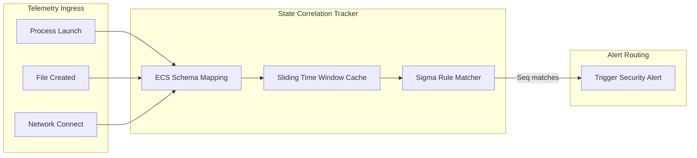

# 🧠 AEGIS EDR - Detection Engine Architecture Design

This document details the architecture, evaluation models, engines, and scoring mechanisms of the AEGIS Endpoint Detection and Response (EDR) detection pipeline.

---

## 1. High-Level Detection Pipeline

The AEGIS Detection Pipeline is a multi-tier threat evaluation loop. It processes incoming telemetry sequentially, running cheap filters first before invoking resource-heavy engines like memory scans or dynamic pattern searches.

```
                      +------------------------------------------+
                      |         Normalized Event (ECS)           |
                      +--------------------+---------------------+
                                           |
                                           v
                      +------------------------------------------+
                      |          Tier 1: Pre-Filter              |
                      |   (Quick Hash & IP Reputation Lookups)   |
                      +--------------------+---------------------+
                                           | Cache Miss / Unverified
                                           v
                      +------------------------------------------+
                      |          Tier 2: Stream Engines          |
                      |    (Sigma log filter matching loops)     |
                      +--------------------+---------------------+
                                           | Alert Trigger / High Risk
                                           v
+----------------------------------------------------------------------------------------+
|                             Tier 3: Deep Scan Engines                                  |
|                                                                                        |
|   +--------------------------+          +------------------------------------------+   |
|   |   YARA Memory Scanner    |          |            Heuristics Engine             |   |
|   |  (Compiled bytecode scan)|          |      (Entropy check, Page permissions)   |   |
|   +--------------------------+          +------------------------------------------+   |
+----------------------------------------+-----------------------------------------------+
                                         |
                                         v
                      +------------------------------------------+
                      |          Tier 4: Risk Scoring            |
                      |       (Compound score calculation)       |
                      +--------------------+---------------------+
                                           | Risk > 8.0?
                                           v
                      +------------------------------------------+
                      |          Mitigation Controller           |
                      |         (Active Containment Host)        |
                      +------------------------------------------+
```

---

## 2. Signature Detection Engine

Signature detection matches endpoint files and executing binary images against cryptographic hashes and compiled byte sequences.

```
                  +-----------------------------------------+
                  |              Executing File             |
                  +--------------------+--------------------+
                                       |
                                       +----> Hash Lookup: SHA256 (Local Reputation DB)
                                       |
                                       +----> Bytecode Scanner: YARA (Active Memory / Disk)
```

### 2.1 Cryptographic Hash Reputation
- **Mechanism**: The daemon checks the SHA256 signature of executing files against a local cache of known malicious files (reputation database).
- **Storage**: Highly indexed, read-optimized SQLite tables containing blacklists synced from threat feeds.

### 2.2 libyara Engine Integration
- **Rule Compilation**: YARA rules are compiled into bytecode during service startup, eliminating file-system parsing latency during scans.
- **Scanning Loops**: Scans are initiated via Cgo wrappers against:
  - Host files on write/launch transitions.
  - Active process virtual memory spaces matching anomalous heuristics (e.g., when a process creates an unbacked executable memory allocation).
- **Concurrency Management**: YARA scan execution is isolated within dedicated OS threads to prevent blocking core Go runtime queues.

---

## 3. Behavioral Detection Engine (Sigma)

The behavioral engine identifies suspicious actions on the host by analyzing system events chronologically.



### 3.1 ECS Mapping & Logging
- **Normalization**: System event data (e.g., Windows ETW logs, Linux eBPF telemetry) is mapped to unified keys (e.g., mapping `ProcessId`, `Image`, `CommandLine`).
- **Stream Evaluator**: The Sigma engine processes this normalized event stream, running fields against loaded Sigma configuration models in memory.

### 3.2 Stateful Correlation
- **State Tracker**: Sigma matches state changes over configurable time windows.
- **Temporal Rules**: Tracks multi-event conditions (e.g., Process A writes file B to a system folder, registers it as a service, and then deletes the installer binary within a 60-second window).
- **Sliding Cache**: Events are held in an in-memory sliding window cache. Once events fall outside the rule's time boundary, they are discarded to reclaim memory.

---

## 4. Heuristic Detection Engine

Heuristics analyze system behaviors dynamically to detect evasion and obfuscation techniques:

```
[Target Process Memory]
        |
        v (Iterate through Virtual Memory ranges)
[Memory Address Traverser]
        |
        +---> Flags: PAGE_EXECUTE_READWRITE? (Unbacked execution memory segment check)
        |
        +---> Byte Pattern: Reflective PE Load? (MZ Header signatures detection)
        v
[Calculate Shannon Entropy]
        |
        +---> Entropy > 7.2? (Flag packed/encrypted sections)
```

- **Unbacked Memory Execution**: Identifies memory pages marked as executable (`PAGE_EXECUTE_READWRITE` or `PROT_EXEC`) that do not map to a file on disk. This is a common indicator of shellcode execution and reflective DLL injection.
- **Entropy Auditing**: Measures the byte randomness (Shannon Entropy) of executing process segments and files. High entropy values (\(H > 7.2\)) indicate packed code or encrypted payloads.
- **Process Lineage Verification**: Tracks parent-child relationships and detects anomalies, such as system binaries spawned with unexpected parent configurations (e.g., `cmd.exe` spawned by `spoolsv.exe`).

---

## 5. Threat Intelligence & IOC Integration

Threat Intelligence modules feed reputation engines with structured threat indicators.

- **IOC Table**: Holds indicators (hashes, domain lists, IP addresses, registry paths) inside indexed local database tables.
- **MITRE ATT&CK Mapping**: Every Sigma rule, YARA signature, and heuristic matches a specific MITRE ATT&CK technique ID (e.g., `T1055` for Process Injection). Telemetry logs expose these tags to simplify triage mapping.
- **STIX/TAXII synchronization**: A background connector syncs external TAXII feeds to the local reputation database.

---

## 6. Compound Risk Scoring Model

AEGIS uses a weighted scoring model to calculate threat severity and determine containment response thresholds:

\[R_c = \min\left(10.0, \sum (W_i \times S_i)\right)\]

Where:
- \(R_c\): The compound risk score, capped at \(10.0\).
- \(W_i\): Engine weight coefficients representing detection confidence:
  - Hash Reputation: \(0.95\)
  - YARA Signature Match: \(0.90\)
  - Heuristic Memory Match: \(0.80\)
  - Behavioral Sigma Correlation: \(0.70\)
- \(S_i\): The individual severity score assigned to the rule (from \(1.0\) to \(10.0\)).

### Mitigating Threshold Actions:
- **\(R_c \ge 5.0\)**: Write alert log entry to SQLite storage and flag event on monitor TUI.
- **\(R_c \ge 8.0\)**: Trigger active containment playbooks (host isolation, process tree termination).

---

## 7. False Positive Reduction

To maintain stability and avoid disrupting legitimate system tasks, AEGIS uses structured whitelists:

- **Cryptographic Whitelisting**: Binaries signed by trusted internal root authorities or verified vendor keys (Microsoft, Apple) bypass behavioral scanning filters.
- **Scoped Exclusions**: Exclusions specify strict scopes to prevent malware abuse:
  - *Invalid Exclusions*: Excluding file path `/tmp/` globally.
  - *Valid Exclusions*: Excluding write events under `/tmp/backup.log` ONLY if executed by binary `/usr/bin/backup` signed with a specific signature hash.
- **Exclusion Verification**: Exclusion configurations are signed. The daemon validates their signature hash before loading exclusions, preventing local modification attacks.
