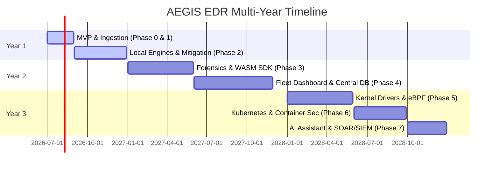

# 🗺️ AEGIS EDR - Multi-Year Development Roadmap

This document outlines the development milestones, architectural goals, and feature releases for the AEGIS EDR project. It guides contributors and enterprise users on our development path over the next three years.

---

## 📅 High-Level Timeline

---

## 📌 Phase-by-Phase Roadmap

### Phase 0: Minimum Viable Product (MVP) [Completed]
- [x] Privileged daemon (`aegisd`) and CLI client (`aegis`) split.
- [x] Basic process execution and file integrity monitoring under Linux/Windows.
- [x] SQLite local storage engine configured in WAL mode.
- [x] Basic client commands (`aegis status`, `aegis scan`).

---

### Phase 1: Telemetry Expansion & Foundation [Year 1 - Q3]
*Focus: Broaden cross-platform telemetry coverage and implement signature matching.*

- **Ingress Modules**:
  - ETW process and network events collection on Windows.
  - Basic eBPF `execve` tracing on Linux.
  - Endpoint Security Framework (ESF) execution tracking on macOS.
- **Detections**:
  - Hash reputation caching and signature lookup tables.
  - libyara runtime integration for folder scans.
- **Integrations**:
  - Structured JSON logs output, ready for forwarding.

---

### Phase 2: Local Multi-Engine Detection & Mitigation [Year 1 - Q4]
*Focus: Real-time correlation, memory auditing, and host containment.*

- **Detections**:
  - In-memory Sigma rule evaluator.
  - Memory analysis targeting unbacked memory allocations and inline hooking.
  - Shannon Entropy calculator for packed file detections.
- **Mitigation Actions**:
  - Process tree termination (`TerminateProcess`/`SIGKILL`).
  - Network isolation using firewall engines (WFP, iptables, Packet Filter).
  - AES-256-GCM encrypted file quarantine protocol.
  - Rule-based automated response execution.

---

### Phase 3: Digital Forensics & WebAssembly SDK [Year 2 - Q1/Q2]
*Focus: Forensics timelines, sandbox plugin support, and offline threat intelligence.*

- **Forensics**:
  - Timeline generation tool merging process, file, and network events.
  - Artifact collectors (Prefetch, Shimcache, launchd/systemd plists, shell history).
- **Extensibility**:
  - Sandboxed WebAssembly (WASM) Plugin SDK using the Wasmtime engine.
  - Manifest-based permission system for WASM plugins.
- **Threat Intelligence**:
  - Offline STIX/TAXII indicator synchronization client.

---

### Phase 4: Fleet Management & Central Console [Year 2 - Q3/Q4]
*Focus: Centralized management console, remote policies, and analytical database backends.*

- **Central Console**:
  - Central fleet manager dashboard (Next.js & TypeScript).
  - Secure agent enrollment protocols using mTLS.
- **Remote Configuration**:
  - Remote deployment of policy files and rules.
  - Centralized real-time telemetry stream viewer.
- **Database Scaling**:
  - Central collector integration with TimescaleDB for time-series events and ClickHouse for security analytics queries.

---

### Phase 5: Advanced Kernel Integration & Swarms [Year 3 - Q1/Q2]
*Focus: Kernel-level protection, deep system tracing, and distributed defense.*

- **Kernel Hooks**:
  - Windows minifilter driver development to block file mutations before they write to disk.
  - Expanded eBPF tracing (kprobes/uprobes/tracepoints) to intercept system operations.
- **Swarm Operations**:
  - Peer-to-peer threat intelligence sharing. If one agent blocks a malicious hash or IP, it distributes the signature to peer agents across the subnet.

---

### Phase 6: Cloud Native & Kubernetes Security [Year 3 - Q3]
*Focus: Container environments, runtime security, and Kubernetes audits.*

- **Container Telemetry**:
  - Telemetry gathering for container runtimes (Docker, containerd, CRI-O).
  - Container boundary breakout detection heuristics.
- **Kubernetes Auditing**:
  - Ingestion of Kubernetes audit logs.
  - Container compliance checking policies.

---

### Phase 7: AI Threat Assistant, SOAR, & SIEM Connectors [Year 3 - Q4]
*Focus: Local AI analysis, automated SOAR playbooks, and SIEM connectors.*

- **AI Threat Assistant**:
  - Quantized local LLM integration to analyze forensic timelines and generate human-readable alert summaries directly in the CLI.
- **Enterprise Integrations**:
  - Bidirectional API integration with SOAR platforms (Splunk SOAR, Cortex XSOAR) via gRPC.
  - Dedicated syslog forwarding connectors for SIEM platforms (Splunk, Microsoft Sentinel).
