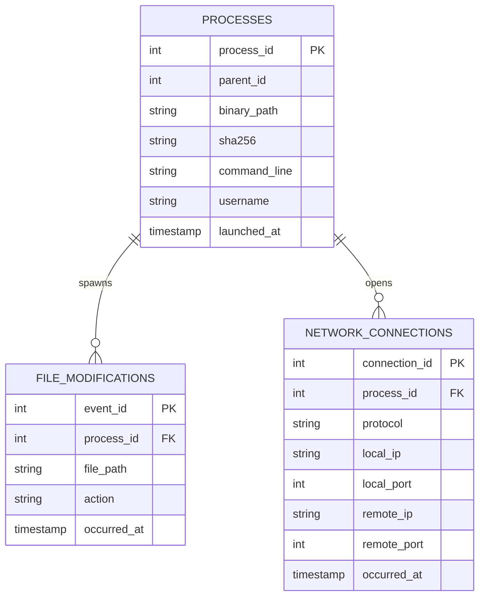

# 🗄️ AEGIS EDR - Local Database Architecture & Schema Design

This document details the database engine, table structures, relationships, indexing, retention policies, and scaling strategies for the AEGIS local storage engine.

---

## 1. Database Architecture & Storage Strategy

AEGIS uses an embedded database strategy to write telemetry events on the endpoint with minimal resource footprint:
- **SQLite 3**: Serves as the primary local event, configuration, and audit logging store.
- **Write-Ahead Logging (WAL) Mode**: Journaling is configured as `PRAGMA journal_mode=WAL;`. This enables concurrent read operations while writes are actively committed to the disk.
- **Single-Writer Thread Pool**: Go database connection pools are configured with `SetMaxOpenConns(1)` for write operations. This prevents write-lock congestion while allowing multiple parallel reader threads.
- **LSM-Tree Staging Cache**: A fast, key-value LSM-tree database (BadgerDB) stages raw event logs during high-volume events (e.g., file copy storms), preventing disk write bottlenecks in SQLite.

---

## 2. Database Schema & Tables

The schema is normalized to separate process, file, and network events while retaining relational integrity through foreign keys.

### 2.1 Table: `processes`
Stores metadata on process execution events.

| Field | Data Type | Constraint | Description |
|---|---|---|---|
| `process_id` | `INTEGER` | `PRIMARY KEY` | Unique process ID (PID). |
| `parent_id` | `INTEGER` | `NULL` | Parent process ID (PPID). |
| `binary_path` | `TEXT` | `NOT NULL` | Path to the executable binary. |
| `sha256` | `TEXT` | `NOT NULL` | Executable hash signature. |
| `command_line` | `TEXT` | `NULL` | Full command-line execution arguments. |
| `username` | `TEXT` | `NOT NULL` | Executing user account name. |
| `launched_at` | `TIMESTAMP` | `DEFAULT CURRENT_TIMESTAMP` | Time of execution launch (UTC). |

---

### 2.2 Table: `file_modifications`
Stores filesystem modification telemetry.

| Field | Data Type | Constraint | Description |
|---|---|---|---|
| `event_id` | `INTEGER` | `PRIMARY KEY AUTOINCREMENT` | Unique event ID. |
| `process_id` | `INTEGER` | `FOREIGN KEY` | Executing process identifier (PID). |
| `file_path` | `TEXT` | `NOT NULL` | Targeted file path on filesystem. |
| `action` | `TEXT` | `NOT NULL` | Operation type: `CREATE`, `WRITE`, `DELETE`. |
| `occurred_at` | `TIMESTAMP` | `DEFAULT CURRENT_TIMESTAMP` | Time of filesystem event (UTC). |

---

### 2.3 Table: `network_connections`
Stores network socket telemetry.

| Field | Data Type | Constraint | Description |
|---|---|---|---|
| `connection_id` | `INTEGER` | `PRIMARY KEY AUTOINCREMENT` | Unique connection ID. |
| `process_id` | `INTEGER` | `FOREIGN KEY` | Executing process identifier (PID). |
| `protocol` | `TEXT` | `NOT NULL` | Protocol type: `TCP` or `UDP`. |
| `local_ip` | `TEXT` | `NOT NULL` | Source IP address. |
| `local_port` | `INTEGER` | `NOT NULL` | Source port number. |
| `remote_ip` | `TEXT` | `NOT NULL` | Destination IP address. |
| `remote_port` | `INTEGER` | `NOT NULL` | Destination port number. |
| `occurred_at` | `TIMESTAMP` | `DEFAULT CURRENT_TIMESTAMP` | Time of socket connection (UTC). |

---

### 2.4 Table: `alert_logs`
Stores alerts generated by rule engines and heuristics.

| Field | Data Type | Constraint | Description |
|---|---|---|---|
| `alert_id` | `INTEGER` | `PRIMARY KEY AUTOINCREMENT` | Unique alert ID. |
| `risk_score` | `REAL` | `NOT NULL` | Calculated compound risk rating. |
| `rule_name` | `TEXT` | `NOT NULL` | Violating Sigma or YARA rule identity. |
| `trigger_value` | `TEXT` | `NULL` | Event detail that triggered the alert. |
| `occurred_at` | `TIMESTAMP` | `DEFAULT CURRENT_TIMESTAMP` | Time of alert generation (UTC). |

---

### 2.5 Table: `ioc_reputation`
Stores threat intelligence indicators loaded on the agent.

| Field | Data Type | Constraint | Description |
|---|---|---|---|
| `ioc_value` | `TEXT` | `PRIMARY KEY` | Indicator key (SHA256, Domain, IP). |
| `ioc_type` | `TEXT` | `NOT NULL` | Indicator type: `sha256`, `domain`, `ipv4`. |
| `threat_actor` | `TEXT` | `NULL` | Threat group association. |
| `mitre_tactic` | `TEXT` | `NULL` | MITRE ATT&CK tactic/technique ID mapping. |
| `severity` | `REAL` | `NOT NULL` | Threat severity score. |
| `updated_at` | `TIMESTAMP` | `DEFAULT CURRENT_TIMESTAMP` | Timestamp of latest sync. |

---

### 2.6 Table: `audit_trail`
Stores logs of administrative actions and containment events.

| Field | Data Type | Constraint | Description |
|---|---|---|---|
| `audit_id` | `INTEGER` | `PRIMARY KEY AUTOINCREMENT` | Unique audit log ID. |
| `action` | `TEXT` | `NOT NULL` | Administrative action (e.g. `KILL`, `ISOLATE`). |
| `operator` | `TEXT` | `NOT NULL` | Username initiating the action. |
| `target` | `TEXT` | `NOT NULL` | Target identifier (PID, IP, path). |
| `status` | `TEXT` | `NOT NULL` | Execution status: `SUCCESS` or `FAILED`. |
| `occurred_at` | `TIMESTAMP` | `DEFAULT CURRENT_TIMESTAMP` | Time of operation (UTC). |

---

## 3. Database Relationships

The entity-relationship diagram below maps relationships between core telemetry tables:



---

## 4. Performance Indexing Strategy

Indexes are added to fields queried frequently during timeline generation and reputation checks:

- **`idx_processes_launched_at`**: Speed up chronological forensics queries:
  ```sql
  CREATE INDEX idx_processes_launched_at ON processes(launched_at DESC);
  ```
- **`idx_file_path`**: Speed up searches for file modification history:
  ```sql
  CREATE INDEX idx_file_path ON file_modifications(file_path);
  ```
- **`idx_network_dest`**: Speed up threat hunting queries looking for malicious connections:
  ```sql
  CREATE INDEX idx_network_dest ON network_connections(remote_ip, remote_port);
  ```
- **`idx_processes_sha256`**: Speed up reputation lookups on process execution:
  ```sql
  CREATE INDEX idx_processes_sha256 ON processes(sha256);
  ```

---

## 5. Data Retention & Pruning Engine

To limit disk usage, a background task automatically purges historical telemetry:
- **Retention Window**: Events older than 7 days are deleted daily unless they are linked to active alert logs.
- **SQL Pruning Routine**:
  ```sql
  DELETE FROM file_modifications 
  WHERE occurred_at < datetime('now', '-7 days')
    AND process_id NOT IN (SELECT distinct process_id FROM alert_logs);

  DELETE FROM network_connections 
  WHERE occurred_at < datetime('now', '-7 days')
    AND process_id NOT IN (SELECT distinct process_id FROM alert_logs);

  DELETE FROM processes 
  WHERE launched_at < datetime('now', '-7 days')
    AND process_id NOT IN (SELECT distinct process_id FROM alert_logs);

  VACUUM;
  ```

---

## 6. Future Database Scaling

As the EDR system scales to support fleet management, storage architecture will expand to support centralized databases:

- **TimescaleDB**: Used at the fleet manager console layer to ingest high-volume telemetry time-series events.
- **ClickHouse**: Columnar database integration for high-speed security analytics and threat hunting queries across thousands of agents.
- **Elasticsearch/OpenSearch**: Used for central indexing and search of unstructured log data.
