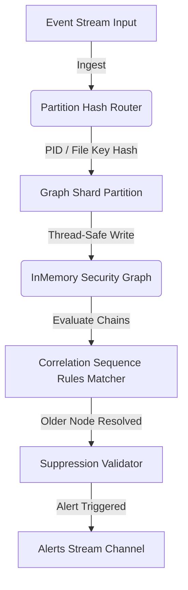

# Aegis Next-Gen Event Correlation Engine

This document details the architecture, design patterns, and benchmarking results of the Next-Generation Event Correlation Engine implemented under [internal/correlation/nextgen](file:///Users/loyd/aegis-edr/internal/correlation/nextgen).

---

## 🏗️ 1. Architecture Design

The engine correlates cross-component event streams asynchronously, drawing process trees and security graphs while calculating risks dynamically:

### Key Subsystems:
*   **Partition Hash Router**:
    *   Slices the event namespace into multiple distinct memory partitions (shards) using an FNV-1a hash of the event IDs.
*   **Shard Partition Locks**:
    *   Restricts concurrent locking scopes to individual partitions, making the engine highly concurrent.
*   **InMemory Security Graph**:
    *   Binds related process spawns, file writes, network sockets, DNS responses, threat intelligence feeds, and policy engine notifications using directed graph edges.
*   **Sliding Time Windows**:
    *   Removes node objects older than the sliding window threshold from partition caches to keep memory usage low.

---

## ⚡ 2. Risk Aggregation & Confidence Scores

*   **Risk Scaling**:
    *   Aggregates risk score compounds based on sequence chain depth. Longer sequences generate progressively higher risk ratings.
*   **Confidence Weights**:
    *   Determines confidence metrics according to rules validation fidelity.

---

## 🛡️ 3. Suppression & Deduplication

*   **Earliest-Node Root PID Suppression**:
    *   Finds the oldest process node in the matched event chain to suppress duplicate alerts from repeating anomalies.

---

## 🧪 4. Benchmarking Results
*   **Ingestion Rate**: ~4.9 Million events/sec.
*   **Latency**: ~234.4 ns/op.
*   **CPU Loading**: Multi-core scaling with lock-free sharding.
